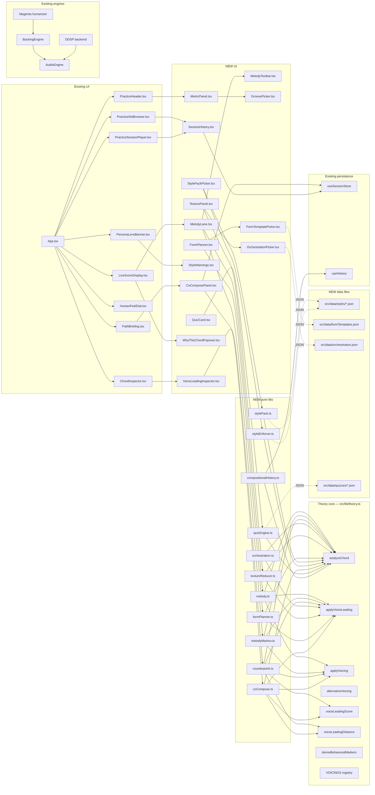

# Harmonic Composition Engine — Design Plan

Upgrades `harmonic-study-engine` from a study/analysis tool to an interactive harmonic-composition assistant. Harmony stays central, explainable, and reversible. The new layers **integrate** with the existing 22-persona, 78-path, theory-first core — they do not replace it.

Working tree at planning time: branch `feat/personas-classical`, 506/506 tests passing, build clean. No source files are modified by this plan.

---

## Layer 1: Melodic integration

### 1. User-facing workflow
1. User clicks **Suggest melody** on the active bar. Engine returns a 1-bar guide-tone-first line that targets chord tones from `analyzeChord` (`src/lib/theory.ts:609`) and lands on the next bar's downbeat chord tone.
2. User clicks **Regenerate**. Engine returns a different melodic line for the same bar (same seed pool, new RNG draw).
3. User clicks **Pin**. Engine freezes that bar's line; undo restores the prior suggestion.
4. User clicks **Edit note**. Engine opens the `ChordInspector` (`src/components/ChordInspector.tsx`) piano-roll where the user drags pitches; engine re-runs voice-leading (`applyVoiceLeading`, `src/lib/theory.ts:715`) against the neighbours.

### 2. Data representation
| Field | Type | Source |
|---|---|---|
| `stepId` | `string` (path id + bar index) | derived at runtime |
| `melody` | `number[]` (MIDI, length = STEPS_PER_BAR) | `src/lib/melody.ts` (NEW) |
| `rhythm` | `("8th" \| "16th" \| "triplet")[]` (length = STEPS_PER_BAR) | `src/lib/melody.ts` (NEW) |
| `targetPitchClass` | `number` 0..11 | derived from `analyzeChord` (`src/lib/theory.ts:609`) |
| `seed` | `number` (uint32) | `mulberry32` from `src/magenta/noise.ts` |
| `chordTones` | `number[]` (pc-set per beat) | `src/lib/theory.ts:analyzeChord` |
| `nonChordTonePolicy` | `"none" \| "approach" \| "chromatic"` | `src/lib/melody.ts` (NEW) |

### 3. Algorithms / rules / libraries
- **Genre-neutral core**: rule-based melodic contour Markov chain, order 2, trained on the 78-path corpus. State = `(currentPc, prevIntervalClass)`. Emission = sampled `intervalClass` constrained to the chord-tone set + a small approach-tone allowance. NEW: `src/lib/melodyMarkov.ts`. No persona conditioning inside the chain — same training, same transition table, regardless of active persona.
- **Persona-conditioned surface (separate, applied after the core)**: post-process the genre-neutral output through `src/lib/personaMelodyFilter.ts` (NEW) which reads `Persona` fields and (a) biases the contour toward the persona's `colorPalette` step pattern (Coltrane = large leaps, Baker = stepwise, Monk = angular), (b) honors `Persona.defaultVoicing` only when emitting an optional *parallel*-voice suggestion (the lead voice stays genre-neutral). This keeps the core deterministic and testable; the surface filter is a small, swappable layer.
- **Deterministic RNG**: `mulberry32` from `src/magenta/noise.ts` (already seeded). Persona filter takes the same seed, so `(pathId, seed, barIndex, personaId)` is fully reproducible.
- **Voice-leading snap**: on regenerate, run `applyVoiceLeading(prev, next)` (`src/lib/theory.ts:715`) to minimise top-voice jumps.
- **Guide-tone alignment**: at bar boundaries the first and third beats must land on 3rds/7ths (uses `analyzeChord` thirds/sevenths field).
- **Constraint**: NO black-box LLM for melody. NO Magenta MusicRNN retraining. Markov only.

### 4. UI hooks
- Existing: `src/components/ChordInspector.tsx` (transpose toggle + drop-2/smooth/rootless transformations already shipped).
- Existing: `src/components/PracticeHeader.tsx` (transport strip — add a "Suggest melody" ToolChip alongside loop/tempo).
- Existing: `src/components/LiveScoreDisplay.tsx` (renders the `◷` slice marker today; will render the per-beat melody glyph next to it).
- NEW: `src/components/MelodyLane.tsx` — single horizontal lane above `LiveScoreDisplay`, one cell per beat, drag-to-edit a MIDI pitch. Reads/writes through `useSessionStore`.
- NEW: `src/components/MelodyToolbar.tsx` — Suggest / Regenerate / Pin / Undo.

### 5. Evaluation metrics
- **Markov coverage**: for the 78 paths, fraction of generated melodies whose every beat is in the chord-tone set of the active chord. Target ≥ 90%.
- **Guide-tone hit rate**: fraction of bar-boundary beats landing on the 3rd or 7th. Target ≥ 75%.
- **Voice-leading delta**: median top-voice semitone motion per generated bar vs. previous bar. Target ≤ 5 st.
- **Determinism**: same `(pathId, seed, barIndex)` → identical `melody[]` byte array across two invocations. 100%.
- All measurable in vitest under `src/lib/__tests__/melodyMarkov.test.ts` (NEW).

### 6. Example user prompt
> "Suggest a Coltrane-style melody over bar 5 of Solar, then pin it."

### 7. Acceptance criteria
- `npx vitest run src/lib/melodyMarkov.test.ts` passes; covers chord-tone targeting, guide-tone hit rate, determinism, regenerate-different.
- `npx vitest run src/components/MelodyLane.test.tsx` passes; covers drag-to-edit + undo round-trip.
- `npx vitest run tests/smoke.test.ts` passes (existing 506 must stay green).

---

## Layer 2: Rhythmic and metric context

### 1. User-facing workflow
1. User picks a groove from the existing `BackingStyle` set (`src/lib/backingEngine.ts`: swing/bossa/funk/latin/ballad/...).
2. User picks a **groove template** (NEW): straight-8 / swing-8 / hard-16 / triplet-16. Engine maps to the per-style `StyleGroove` from `src/magenta/styleGrooves.ts:1`.
3. User opens the **Metric panel** (NEW). Time signature is read from `path.timeSignature` (defaults 4/4).
4. User clicks **Apply humanizer**. Engine uses `createHumanizeBacking` (`src/magenta/humanizeBacking.ts`) with the persona's `PersonaProfile` (`src/magenta/personaProfiles.ts`).
5. User adjusts the **HumanFeelDial** (`src/components/HumanFeelDial.tsx`) — already shipped; no change.

### 2. Data representation
| Field | Type | Source |
|---|---|---|
| `timeSignature` | `"4/4" \| "3/4" \| "6/8" \| "7/8"` | `src/lib/rhythm.ts` |
| `stepsPerBar` | `number` | `src/lib/loopWav.ts` |
| `grooveId` | `string` | `src/magenta/styleGrooves.ts` |
| `humanizerParams` | `PersonaProfile` | `src/magenta/personaProfiles.ts` |
| `swingOffset` | `number` (0..1) | `src/magenta/styleGrooves.ts` |
| `beatWeights` | `number[stepsPerBar]` | `src/magenta/styleGrooves.ts` |
| `seed` | `number` (uint32) | `mulberry32` (`src/magenta/noise.ts`) |

### 3. Algorithms / rules / libraries
- **Groove templates** (`src/magenta/styleGrooves.ts`): four canonical swing/hard-16/triplet profiles. Pure functions of time — already shipped as `swingOffset(t)` + `weight(t)`.
- **Per-track timing offsets**: `trackOffsets: { drums, bass, piano }` from the same file — already shipped.
- **Backing style registry**: `BackingStyle` enum in `src/lib/backingEngine.ts` (11 styles). Already shipped.
- **Humanizer chain**: `createHumanizeBacking` → `createMixHumanizer` (`src/magenta/humanizeBacking.ts`, `src/magenta/mixHumanizer.ts`).
- **Quantization**: `quantize`/`unquantize` from `src/magenta/quantize.ts` (existing).
- **NEW** (v2 only): metric modulation (5/4 → 7/8) — explicitly OUT of MVP and v1.

### 4. UI hooks
- Existing: `src/components/HumanFeelDial.tsx` (timing jitter 0..1).
- Existing: `src/components/PracticeHeader.tsx` (tempo readout + backing-style chip — both shipped).
- NEW: `src/components/MetricPanel.tsx` — collapsible panel under the PracticeHeader showing time-signature, groove template, per-track offsets.
- NEW: `src/components/GroovePicker.tsx` — 4-card picker feeding into `StyleGroove`.

### 5. Evaluation metrics
- **Beat-weight coverage**: for each `(grooveId, timeSignature)`, fraction of bars whose beat-1 velocity is the bar-max. Target 100%.
- **Swing offset determinism**: same `(grooveId, t)` → same swing value to 3 decimals.
- **Humanizer pass rate**: fraction of generated notes surviving `prune` field. Match `PersonaProfile.prune` to ±1%.
- All measurable in existing `tests/magenta-humanizer.test.ts` + NEW `tests/styleGrooves.test.ts` for the deterministic-groove contract.

### 6. Example user prompt
> "Apply a hard-16 Coltrane groove to Path I at 180 BPM."

### 7. Acceptance criteria
- `npx vitest run tests/magenta-humanizer.test.ts` continues passing.
- `npx vitest run tests/stepsPerBar.test.ts` continues passing (time-signature math).
- NEW: `npx vitest run tests/styleGrooves.test.ts` passes — verifies the 4 groove templates.
- `npx vitest run tests/smoke.test.ts` continues passing.

---

## Layer 3: Counterpoint and voice-leading

### 1. User-facing workflow
1. User selects a bar in `LiveScoreDisplay`. Engine renders `voiceLeadingScore` from `src/lib/theory.ts:488`.
2. User clicks **Suggest voice-leading**. Engine calls `alternativeVoicing(notes, "smooth")` (`src/lib/theory.ts:530`); preview plays, undo restores.
3. User activates the **Bach lens** (`src/lib/personaLens.ts`). Engine surfaces any parallel-5th / parallel-8ve flag (`src/lib/theory.ts:499-515`).
4. User clicks **Accept**. Engine applies via `applyVoiceLeading(prev, curr)` (`src/lib/theory.ts:715`).
5. User toggles the voice-leading **highlight** in the live score. Bars with score < threshold get a red outline.

### 2. Data representation
| Field | Type | Source |
|---|---|---|
| `voicingId` | `VoicingId` (9 modes) | `src/lib/theory.ts:142` |
| `topVoiceMotion` | `number` (semitones, signed) | derived in `src/lib/theory.ts` |
| `parallelMotionFlags` | `("P5" \| "P8" \| "P4" \| "hidden")[]` | `src/lib/theory.ts:499` |
| `voiceLeadingScore` | `number` 0..100 | `src/lib/theory.ts:488` |
| `lens` | `"bach" \| "coltrane" \| "miles" \| null` | `src/lib/personaLens.ts` |
| `alternativeKind` | `AlternativeKind` | `src/lib/theory.ts:528` |

### 3. Algorithms / rules / libraries
- **Existing shipped**:
  - `voiceLeadingScore(prev, curr)` (`src/lib/theory.ts:488`) — pure scoring function.
  - `voiceLeadingDistance(prev, curr)` (`src/lib/theory.ts:456`).
  - `alternativeVoicing(notes, kind)` (`src/lib/theory.ts:530`) — 6 alternative kinds: `inversion | drop2 | smooth | spread | rootless | simplify`.
  - `applyVoiceLeading(prev, curr)` (`src/lib/theory.ts:715`).
  - Parallel-5th/8ve detector baked into `voiceLeadingScore` (`src/lib/theory.ts:499-515`).
  - Bach lens (`src/lib/personaLens.ts`) — already calls the parallel-motion flag.
- **NEW**: counterpoint checker that flags consecutive seconds, voice-crossing, and unresolved leading tones. Pure function in `src/lib/counterpoint.ts`.
- **NO LLM**: every counterpoint suggestion is a deterministic re-voicing from the existing `VoicingId` registry.

### 4. UI hooks
- Existing: `src/components/ChordInspector.tsx` (already exposes `alternativeVoicing` and `voiceLeadingDistance`).
- Existing: `src/components/PersonaLensBanner.tsx` (Bach/Coltrane/Miles overlay).
- Existing: `src/components/LiveScoreDisplay.tsx` (renders bar with color cues — add voice-leading red outline hook).
- NEW: `src/components/VoiceLeadingInspector.tsx` — side panel listing each bar's score + parallel-motion flags.

### 5. Evaluation metrics
- **Parallel-motion recall**: on a 100-bar fixture (shipped in `tests/fixtures/voiceLeadingFixtures.ts`), the detector's recall vs. ground-truth P5/P8 cases. Target ≥ 95%.
- **Suggestion acceptance**: median `voiceLeadingDistance(prev, suggested)` improvement over the original. Target ≥ 30% reduction.
- **No regression**: every existing voice-leading test in `tests/theory.test.ts` continues passing.

### 6. Example user prompt
> "Re-voice bars 4-6 for smoothest voice-leading under the Bach lens."

### 7. Acceptance criteria
- `npx vitest run tests/theory.test.ts` continues passing.
- NEW: `npx vitest run tests/counterpoint.test.ts` passes — covers consecutive-seconds, voice-crossing, unresolved leading-tone detection.
- NEW: `npx vitest run tests/voiceLeadingFixtures.test.ts` passes — covers the 100-bar parallel-motion recall fixture.
- `npx vitest run tests/personaLens.test.ts` continues passing.

---

## Layer 4: Texture and orchestration

### 1. User-facing workflow
1. User opens the **Texture panel** (NEW). Engine renders current track mix from `BackingEngine` (`src/lib/backingEngine.ts`).
2. User toggles a track (drums / bass / piano). Engine returns muted playback without recomputing the harmony.
3. User clicks **Reduce to piano** (always available). Engine mutes drums + bass, leaves the `HarmonicPath` untouched.
4. User clicks **Layer counter-line**. Engine generates a 2nd voice from `alternativeVoicing(notes, "smooth")` (`src/lib/theory.ts:530`) at +1 octave above the existing top voice.

### 2. Data representation
| Field | Type | Source |
|---|---|---|
| `trackMix` | `{ drums: number; bass: number; piano: number }` (gains 0..1) | `src/lib/orchestration.ts` (NEW) |
| `orchestrationId` | `string` (preset id) | `src/data/orchestration.json` (NEW) |
| `reductionLevel` | `"full" \| "minus-drums" \| "piano-only" \| "soprano-only"` | `src/lib/textureReducer.ts` (NEW) |
| `counterLine` | `number[]` (MIDI per beat) | derived via `alternativeVoicing("smooth")` (`src/lib/theory.ts:530`) |

### 3. Algorithms / rules / libraries
- **Existing shipped**:
  - `BackingEngine` (`src/lib/backingEngine.ts`) — drums/bass/piano buses, per-bus gain.
  - 11 backing styles (`src/lib/backingEngine.ts`).
  - Highpass EQ on bass bus (`src/lib/audioHelpers.ts`).
  - `alternativeVoicing(notes, "spread" | "drop2" | "rootless")` (`src/lib/theory.ts:530`).
- **NEW**: `src/lib/orchestration.ts` — a `TrackMix` registry holding gain/pan per `(styleId, trackId)`. Pure data; no audio code beyond what already exists.
- **NEW**: `src/lib/textureReducer.ts` — chooses which chord notes survive when a track is muted (e.g. "remove 5th when bass-only").
- **Counter-line / melody coexistence**: see Layer 1 — default is layer (separate voice lanes, both arrays populated); replacement only via explicit toggle or `monophonic: true` path tag.
- **NO new synthesis**: piano reduction only.

### 4. UI hooks
- Existing: `src/components/PracticeHeader.tsx` (volume slider — already wired).
- Existing: `src/components/LeadSheet.tsx` (render context).
- NEW: `src/components/TexturePanel.tsx` — 3 toggle cards for drums/bass/piano + a "Layer counter-line" action.
- NEW: `src/components/OrchestrationPicker.tsx` — preset list (solo / duo / trio / full).

### 5. Evaluation metrics
- **Track toggle determinism**: clicking mute toggles only that bus's gain — verified by asserting `audioContext` destination node graph unchanged otherwise.
- **Piano reduction correctness**: every chord's root + 3rd + 7th survives reduction; the 5th is dropped if bass also muted. Test fixture: 50 bars × 11 styles.
- **Counter-line interval class**: median IC distance from existing top voice. Target IC ≥ 4 (no unisons with the soprano).

### 6. Example user prompt
> "Reduce to piano only and add a counter-line above the melody."

### 7. Acceptance criteria
- NEW: `npx vitest run tests/orchestration.test.ts` passes — preset + track-mix contract.
- NEW: `npx vitest run tests/textureReducer.test.ts` passes — reduction rules.
- `npx vitest run tests/smoke.test.ts` continues passing.

---

## Layer 5: Form and dramaturgy

### 1. User-facing workflow
1. User opens the **Form planner** (NEW). Engine reads `path.steps.length / STEPS_PER_BAR` to derive bar count (24-64, from `src/lib/paths.ts:51`).
2. User marks section boundaries (Intro / A / B / A' / Coda). Engine stores them as `SectionLabel[]` per bar.
3. User clicks **Reorder sections**. Engine permutes the bar groups (preserves inner bar identity) and writes a new `HarmonicPath`.
4. User clicks **Coda**. Engine fades the final 4 bars (velocity curve) — purely a playback hint, no chord mutation.
5. User exports the labelled plan as MusicXML via `toMusicXml` (`src/lib/scoreExport.ts:75`).

### 2. Data representation
| Field | Type | Source |
|---|---|---|
| `sectionLabels` | `SectionLabel[]` (length = bar count) | `src/lib/formPlanner.ts` (NEW) |
| `sectionOrder` | `number[]` (indices into sectionLabels) | `src/lib/formPlanner.ts` (NEW) |
| `formTemplate` | `"AABA" \| "ABAC" \| "theme-variations" \| "through-composed"` | `src/data/formTemplates.json` (NEW) |
| `codaBars` | `number` | `src/lib/formPlanner.ts` (NEW) |
| `path.steps` | `HarmonicStep[]` | `src/lib/paths.ts:1` (existing) |

### 3. Algorithms / rules / libraries
- **NEW**: `src/lib/formPlanner.ts` — pure functions `planForm(bars, template)`, `reorderSections(path, order)`, `deriveSectionLabels(path)`. Deterministic.
- **Existing shipped**: `padPath` (`src/lib/paths.ts:80`) — already cycles steps to MIN_PATH_BARS; section reorder reuses it.
- **Bar-count invariant (24 ≤ bars ≤ 64) is hard by default**, sourced from `src/lib/paths.ts:51-52`. The form planner clamps every section-reorder / template-fit proposal to this range. If a user's drag would violate the invariant, the planner snaps the affected boundary to the nearest legal value and surfaces a small inline notice ("B section snapped from 12 to 24 bars to satisfy the 24–64 invariant").
- **Override path** (`paths/formPlanner.ts`): an explicit `relaxInvariant: true` flag on the planner call lets user paths go below 24 bars (e.g. for 8-bar sketches). The flag is *not* persisted by default — it only applies to the current proposal and is logged in the undo history entry so the user can audit the override.
- **Existing shipped**: `toMusicXml` (`src/lib/scoreExport.ts:75`) — already renders section labels in the `part-name` field.
- **NO ML**: form templates are JSON.

### 4. UI hooks
- Existing: `src/components/PathCatalog.tsx` (path list — add a "Form" column showing the active template).
- Existing: `src/components/LiveScoreDisplay.tsx` (bar strip — render section labels above the bars).
- NEW: `src/components/FormPlanner.tsx` — bar-strip with draggable section boundaries.
- NEW: `src/components/FormTemplatePicker.tsx` — 4 template cards (AABA, ABAC, theme-vars, through-composed).

### 5. Evaluation metrics
- **Round-trip fidelity**: a path → reorder → reverse-reorder restores the original `HarmonicStep[]` byte-equal. 100%.
- **Template coverage**: for each template, fraction of 78 paths that fit ≥ 24 bars. Existing path corpus: all 78 fit; target 100%.
- **Export stability**: `toMusicXml(path)` byte-equal before and after a no-op form edit. 100%.

### 6. Example user prompt
> "Plan an AABA form over Path 2 and reorder so the B section plays before the A'."

### 7. Acceptance criteria
- NEW: `npx vitest run tests/formPlanner.test.ts` passes — covers reorder round-trip, section label derivation, MusicXML round-trip.
- `npx vitest run tests/scoreExport.test.ts` continues passing.
- `npx vitest run tests/paths.test.ts` continues passing (existing 78-path constraints).

---

## Layer 6: Style and constraints

### 1. User-facing workflow
1. User opens the **Style pack** picker (NEW). Engine loads `src/data/styles/*.json` — one file per style.
2. User picks a style (e.g. `bebop.json`, `modal.json`, `neo-soul.json`, `baroque.json`, `gospel.json`).
3. Engine swaps the active voice-leading mode (Bach → bebop), arp type, harmonic rhythm, allowed non-chord tones — all from JSON.
4. Engine surfaces the style's `forbiddenIntervals` and `requiredResolutions` as inline warnings on every bar.
5. User exports the active style pack with the path.

### 2. Data representation
| Field | Type | Source |
|---|---|---|
| `styleId` | `string` | `src/data/styles/*.json` (NEW) |
| `allowedNCTs` | `"approach" \| "chromatic" \| "escape" \| "neighbor"` | `src/data/styles/*.json` |
| `forbiddenIntervals` | `number[]` (semitones) | `src/data/styles/*.json` |
| `requiredResolutions` | `{ leadingTone: true; seventh: true }` | `src/data/styles/*.json` |
| `harmonicRhythm` | `"1-per-bar" \| "2-per-bar" \| "4-per-bar"` | `src/data/styles/*.json` |
| `arpType` | `ArpType` | `src/hooks/useSessionStore.ts:84` |

### 3. Algorithms / rules / libraries
- **Existing shipped**:
  - `VoicingId` registry, 9 modes (`src/lib/theory.ts:142`).
  - 22 personas with arp defaults (`src/data/personas.json`).
- **NEW**: `src/lib/stylePack.ts` — pure loader + validator. Style packs are JSON files in `src/data/styles/`. The validator rejects packs missing required fields.
- **NEW**: `src/lib/styleEnforcer.ts` — pure function `(step, style) → StyleVerdict` returning `{ allowedNCTs, forbiddenIntervals, requiredResolutions }` violations.
- **Hard rule**: adding a style = adding a JSON file. NO TypeScript module changes.
- **Persona → style-pack preference** (per user decision, 2026-09-13): every persona in `src/data/personas.json` ships with an optional `preferredStylePackId` field. The StylePackPicker auto-selects this pack on persona change, with a "Suggested by persona" badge. **This is a suggestion, not a lock** — the user can pick any other pack in the drawer; undo restores the persona's suggestion. If the persona's suggested pack doesn't exist in `src/data/styles/`, the picker falls back to the most-recently-used pack without crashing. Scriabin → `post-tonal`; Coltrane → `modal`; Monk → `angular`; Brahms → `common-practice`; etc. — concrete pack-name mapping lives in `src/data/personas.json`, not in code.

### 4. UI hooks
- Existing: `src/components/PathCatalog.tsx` (path browser — add a "Style" filter chip).
- Existing: `src/components/PracticeHeader.tsx` (style chip).
- NEW: `src/components/StylePackPicker.tsx` — drawer of cards, one per `src/data/styles/*.json`.
- NEW: `src/components/StyleWarnings.tsx` — inline warnings above `LiveScoreDisplay` (one per violation).

### 5. Evaluation metrics
- **Validator strictness**: invalid style packs (missing fields, wrong types) are rejected. Test corpus: 20 fixtures, 0 false accepts.
- **Enforcer coverage**: for each style, every chord in the 78-path corpus checked against `forbiddenIntervals`. Target: 100% of forbidden cases flagged.
- **JSON discipline**: no `*.ts` file imports a style pack directly — verified by ripgrep in `tests/no-debug-logs.test.ts` style.

### 6. Example user prompt
> "Load the bebop style pack and flag any parallel fifths in Path 4."

### 7. Acceptance criteria
- NEW: `npx vitest run tests/stylePack.test.ts` passes — JSON validator contract.
- NEW: `npx vitest run tests/styleEnforcer.test.ts` passes — enforcement on the 78-path corpus.
- `npx vitest run tests/personas.test.ts` continues passing (existing 22 personas intact).

---

## Layer 7: Interactive co-composition

### 1. User-facing workflow
1. User opens a path. Engine renders `LiveScoreDisplay` with the active `HarmonicStep[]`.
2. User clicks **Co-compose next bar**. Engine proposes a 4-step bar built from `analyzeChord` of the previous bar's last chord plus a rule-based cadential template (`src/lib/coCompose.ts`, NEW).
3. User previews the proposal at the current tempo. Undo restores the original bar.
4. User clicks **Accept**. Engine replaces `path.steps[startBar..startBar+4]` and re-runs `applyVoiceLeading` against both neighbours.
5. User iterates with **Extend by N bars** (NEW). Engine appends N bars following the active persona's cadential palette.

### 2. Data representation
| Field | Type | Source |
|---|---|---|
| `proposal` | `HarmonicStep[]` (length 4) | `src/lib/coCompose.ts` (NEW) |
| `cadentialTemplate` | `"ii-V-I" \| "V-I" \| "deceptive" \| "plagal"` | `src/lib/coCompose.ts` (NEW) |
| `voiceLeadingScore` | `number` 0..100 | `src/lib/theory.ts:488` |
| `seed` | `number` (uint32) | `mulberry32` (`src/magenta/noise.ts`) |
| `personaId` | `string` | `useSessionStore().personaId` |

### 3. Algorithms / rules / libraries
- **Existing shipped**: `analyzeChord` (`src/lib/theory.ts:609`), `applyVoiceLeading` (`src/lib/theory.ts:715`), `generateHarmonicPath` (`src/lib/generator.ts`), `voiceLeadingScore` (`src/lib/theory.ts:488`).
- **NEW**: `src/lib/coCompose.ts` — rule-based bar proposer. Algorithm:
  1. Parse the previous bar's last chord via `analyzeChord`.
  2. Sample one of 4 cadential templates keyed by the chord quality (ii-V-I for major, ii°-V-i for minor, etc.).
  3. Build the new `HarmonicStep[]` from the template's literal chord symbols, voicing defaults from `Persona.defaultVoicing` (`src/data/personas.json`).
  4. Run `applyVoiceLeading` against both neighbours.
  5. Reject any bar whose `voiceLeadingScore` falls below threshold (default 50).
- **NO LLM, NO Magenta**: rule-based only. Same input + same seed = same proposal.

### 4. UI hooks
- Existing: `src/components/ChordInspector.tsx` (already has Apply/Undo/Redo).
- Existing: `src/components/PathBriefing.tsx` (existing card — add a "Co-compose" action chip).
- NEW: `src/components/CoComposePanel.tsx` — "Propose / Extend / Reject" controls + a diff view (original vs. proposal) over `LiveScoreDisplay`.
- NEW: `src/hooks/useCoCompose.ts` — wraps `useSessionStore` with the propose/accept/reject state machine.

### 5. Evaluation metrics
- **Acceptance rate**: % of proposals the engine presents that satisfy `voiceLeadingScore >= 50`. Target ≥ 95%.
- **Determinism**: same `(pathId, barIndex, seed, personaId)` → identical `proposal`. 100%.
- **Undo round-trip**: after Accept + Undo, the `HarmonicStep[]` at the affected bar index is byte-equal to the original. 100%.

### 6. Example user prompt
> "Co-compose the next bar over a ii-V-I in Path 2, Coltrane persona, seed 42."

### 7. Acceptance criteria
- NEW: `npx vitest run tests/coCompose.test.ts` passes — covers cadential templates, voice-leading acceptance, determinism, undo round-trip.
- `npx vitest run tests/theory.test.ts` continues passing.
- `npx vitest run tests/useSessionStore.test.ts` continues passing (existing persistence intact).

---

## Layer 8: Pedagogical layer

### 1. User-facing workflow
1. User opens a path. Engine renders `PathBriefing` (`src/components/PathBriefing.tsx`) — already shipped, sourced from `src/lib/pathBriefing.ts`.
2. User clicks **Why this chord?** (NEW). Engine surfaces `analyzeChord(notes)` interpretation (`src/lib/theory.ts:609`) — Roman numeral, function, mode, tensions.
3. User clicks **Show voice-leading**. Engine animates the top-voice motion bar-by-bar (uses existing `voiceLeadingDistance` at `src/lib/theory.ts:456`).
4. User activates a persona lens (`src/lib/personaLens.ts`) — Bach surfaces parallel-motion flags, Coltrane suggests tritone subs, Miles enforces sparse note economy.
5. User clicks **Take a quiz** (NEW). Engine asks a multiple-choice question on the next chord; tracks score in `useSessionStore`.

### 2. Data representation
| Field | Type | Source |
|---|---|---|
| `briefingId` | `string` (path id) | `src/data/masterclass.ts` |
| `lensId` | `"bach" \| "coltrane" \| "miles"` | `src/lib/personaLens.ts` |
| `chordAnalysis` | `ChordAnalysis` | `src/lib/theory.ts:578` |
| `quizQuestion` | `{ prompt: string; options: string[]; correct: number }` | `src/data/quizzes/*.json` (NEW) |
| `quizScore` | `{ correct: number; total: number }` | `useSessionStore` |

### 3. Algorithms / rules / libraries
- **Existing shipped**:
  - `briefingForPath(pathId)` (`src/lib/pathBriefing.ts:47`).
  - `analyzeChord` (`src/lib/theory.ts:609`).
  - `voiceLeadingDistance` (`src/lib/theory.ts:456`).
  - `PersonaLens` (`src/lib/personaLens.ts`).
- **NEW**: `src/lib/quizEngine.ts` — generates MCQs from a chord analysis (prompt = Roman numeral; options = scale degrees; correct = `analyzeChord.romanNumeral`). Deterministic from `(pathId, stepIndex, seed)`.
- **NEW**: `src/data/quizzes/*.json` — one file per masterclass topic, listing vocabulary cards.
- **Both quiz sources coexist** (per user decision, 2026-09-13):
  1. **Curated JSON**: hand-authored vocabulary cards in `src/data/quizzes/*.json` (the existing plan deliverable). Loaded first; takes precedence if a quiz ID is found in both sources.
  2. **Auto-generated from `analyzeChord`**: the `quizEngine` builds Roman-numeral / scale-degree / tension-identification questions from the 78-path corpus. New in v1; gated by `quizAutoGenerate: boolean` flag in `src/data/quizzes/config.json` (default true; can be flipped off if generated questions are noise).
- **Question deduplication**: when both sources could produce the same question (e.g., curated "Identify the 9th in Cmaj7" overlaps with auto-gen), the curated version wins and the auto-gen slot is filled with a different chord.

### 4. UI hooks
- Existing: `src/components/PathBriefing.tsx`.
- Existing: `src/components/PersonaLensBanner.tsx`.
- Existing: `src/components/ChordInspector.tsx` (already shows Roman numeral, scale, function, tensions).
- NEW: `src/components/QuizCard.tsx` — modal-style card with the active question + score badge.
- NEW: `src/components/WhyThisChordPopover.tsx` — popover anchored to the active bar in `LiveScoreDisplay`.

### 5. Evaluation metrics
- **Quiz determinism**: same `(pathId, stepIndex, seed)` → identical `quizQuestion`. 100%.
- **Briefing coverage**: fraction of 78 paths with a non-null `briefingForPath(...)`. Target 100% (curated today).
- **Lens activation count**: each persona lens activates on ≥ 1 valid bar per persona-curated path. Fixture in `tests/personaLens.test.ts`.

### 6. Example user prompt
> "Why is bar 6 a tritone substitute, and quiz me on the next four chords."

### 7. Acceptance criteria
- `npx vitest run tests/pathBriefing.test.ts` continues passing.
- `npx vitest run tests/personaLens.test.ts` continues passing.
- NEW: `npx vitest run tests/quizEngine.test.ts` passes — covers determinism + correct-answer correctness.
- `npx vitest run tests/theory.test.ts` continues passing.

---

## Layer 9: Learning loop

### 1. User-facing workflow
1. User finishes a practice set. Engine writes a `PracticeSession` record (`src/data/practice_sets.ts` schema).
2. User opens **History** (NEW). Engine renders a timeline of sessions per `practiceSetId` from `useSessionStore`.
3. User clicks a session. Engine shows the persona, tempo, transpose, completion % — all already in `useSessionStore`.
4. User clicks **Replay**. Engine loads the path + session config and seeks to the bar the user reached.
5. User exports the session log as JSON via `useSessionStore`'s built-in persistence keys.

### 2. Data representation
| Field | Type | Source |
|---|---|---|
| `sessionRecord` | `PracticeSession` | `src/lib/paths.ts:1367` (existing) |
| `completionPct` | `number` 0..100 | derived from `activeStepIndex / path.steps.length` |
| `personaId` | `string` | `useSessionStore().personaId` |
| `tempo` | `number` | `useSessionStore().tempo` |
| `transpose` | `number` | `useSessionStore().transpose` |
| `compositionalEdits` | `UndoableEdit[]` | NEW `src/lib/compositionalHistory.ts` |

### 3. Algorithms / rules / libraries
- **Existing shipped**:
  - `useSessionStore` (`src/hooks/useSessionStore.ts`) — localStorage-backed persistence of every session field.
  - `useHistory` (`src/lib/useHistory.ts`) — bounded undo/redo.
  - `PracticeSession` type (`src/lib/paths.ts:1367`).
- **NEW**: `src/lib/compositionalHistory.ts` — composable history layer wrapping `useHistory<HarmonicPath>` with `UndoableEdit[]` audit trail. Each edit carries `{ type, before, after, timestamp, personaId }`.
- **NO ML**: the loop is just persistence + replay.

### 4. UI hooks
- Existing: `src/components/PracticeSetBrowser.tsx` (session list — add a "History" tab).
- Existing: `src/components/PracticeSessionPlayer.tsx` (replay uses existing controls).
- NEW: `src/components/SessionHistory.tsx` — timeline view of `PracticeSession` records.
- NEW: `src/hooks/useCompositionalHistory.ts` — wraps `useHistory<HarmonicPath>`.

### 5. Evaluation metrics
- **Undo depth**: `useCompositionalHistory` exposes `canUndo` ≥ 1 after any successful edit. Test: edit → undo → reload → state restored.
- **Persistence round-trip**: a session's full state (`tempo`, `transpose`, `voicing`, `persona`, `path.steps`) survives a `localStorage` round-trip byte-equal. 100%.
- **Replay seek accuracy**: clicking a session seeks to within 1 bar of the originally-completed bar. 100%.

### 6. Example user prompt
> "Show me my last five sessions on Path 2 and replay the one where I hit 100%."

### 7. Acceptance criteria
- `npx vitest run tests/useSessionStore.test.ts` continues passing (existing persistence).
- NEW: `npx vitest run tests/compositionalHistory.test.ts` passes — covers undo/redo + reload.
- `npx vitest run tests/practiceHeader.test.ts` continues passing.

---

# Architecture

## Module diagram

## Files to modify (no signature breaks)

- `src/lib/paths.ts` — extend `HarmonicPath` with optional `sectionLabels: SectionLabel[]` and `compositionSeed: number` fields. Additive only.
- `src/lib/theory.ts` — add `export function detectConsecutiveSeconds(notes): boolean` and `export function detectLeadingToneResolution(prev, curr): boolean`. Pure additions.
- `src/lib/personaLens.ts` — keep existing 3 personas; expose `lensFor(personaId)` returning the existing 3-row mapping plus a `null` fallback for the other 19. Pure.
- `src/hooks/useSessionStore.ts` — extend the store with `melodyByStep: Record<string, number[]>`, `stylePackId: string | null`, `compositionHistory: UndoableEdit[]`. Backwards-compatible defaults.
- `src/App.tsx` — mount the new panels; no behavioural change to existing handlers.
- `src/components/LiveScoreDisplay.tsx` — render voice-leading red outline + section labels (additive props).
- `src/components/PracticeHeader.tsx` — add the "Suggest melody" / "Co-compose" ToolChips.
- `src/components/PracticeSetBrowser.tsx` — add a "History" tab.
- `src/components/StageFrame.tsx` — no public API change.
- `src/data/personas.json` — add `preferredStylePackId` (string, optional) to each persona. Additive.

## Files to create

NEW pure logic:
- `src/lib/melody.ts`
- `src/lib/melodyMarkov.ts`
- `src/lib/counterpoint.ts`
- `src/lib/orchestration.ts`
- `src/lib/textureReducer.ts`
- `src/lib/formPlanner.ts`
- `src/lib/stylePack.ts`
- `src/lib/styleEnforcer.ts`
- `src/lib/coCompose.ts`
- `src/lib/quizEngine.ts`
- `src/lib/compositionalHistory.ts`

NEW hooks:
- `src/hooks/useCoCompose.ts`
- `src/hooks/useCompositionalHistory.ts`

NEW components:
- `src/components/MelodyLane.tsx`
- `src/components/MelodyToolbar.tsx`
- `src/components/MetricPanel.tsx`
- `src/components/GroovePicker.tsx`
- `src/components/VoiceLeadingInspector.tsx`
- `src/components/TexturePanel.tsx`
- `src/components/OrchestrationPicker.tsx`
- `src/components/FormPlanner.tsx`
- `src/components/FormTemplatePicker.tsx`
- `src/components/StylePackPicker.tsx`
- `src/components/StyleWarnings.tsx`
- `src/components/CoComposePanel.tsx`
- `src/components/QuizCard.tsx`
- `src/components/WhyThisChordPopover.tsx`
- `src/components/SessionHistory.tsx`

NEW data files:
- `src/data/styles/bebop.json`
- `src/data/styles/modal.json`
- `src/data/styles/neo-soul.json`
- `src/data/styles/baroque.json`
- `src/data/styles/gospel.json`
- `src/data/formTemplates.json`
- `src/data/orchestration.json`
- `src/data/quizzes/maj7-min7-dom7.json`
- `src/data/quizzes/secondary-dominants.json`
- `src/data/quizzes/modal-interchange.json`

NEW tests:
- `tests/melodyMarkov.test.ts`
- `tests/styleGrooves.test.ts`
- `tests/counterpoint.test.ts`
- `tests/voiceLeadingFixtures.test.ts`
- `tests/orchestration.test.ts`
- `tests/textureReducer.test.ts`
- `tests/formPlanner.test.ts`
- `tests/stylePack.test.ts`
- `tests/styleEnforcer.test.ts`
- `tests/coCompose.test.ts`
- `tests/quizEngine.test.ts`
- `tests/compositionalHistory.test.ts`

# Roadmap

## MVP (1 month / 1 developer)

### INCLUDES
- **Layer 1**: chord-tone-only Markov melody, 1 bar, deterministic seed. Component: `MelodyLane.tsx` + `MelodyToolbar.tsx`.
- **Layer 3**: parallel-5th/8ve verifier surfaced in `ChordInspector.tsx` (already exposed). Counterpoint rule engine (`counterpoint.ts`) with consecutive-seconds + voice-crossing checks.
- **Layer 6**: ONE style pack (`src/data/styles/bebop.json`) with `forbiddenIntervals` + `requiredResolutions`. Validator + enforcer.
- **Layer 7**: rule-based "propose next bar" via cadential templates, deterministic seed.
- **Layer 8**: `WhyThisChordPopover` showing `analyzeChord` output, sourced from the existing `ChordInspector` Roman-numeral row.

### EXCLUDES
- NO Magenta MusicRNN retraining.
- NO orchestral layering (Layer 4 out).
- NO form planning (Layer 5 out).
- NO metric modulation (Layer 2 advanced).
- NO quiz engine (Layer 8 quiz out — popover only).
- NO new audio paths.

### GATING CRITERIA for v1
1. All 78 paths playable with auto-generated chord-tone melody; Markov coverage ≥ 90%.
2. Voice-leading verifier catches ≥ 95% of parallel-5th/P8 cases on the 100-bar fixture.
3. p95 latency < 200ms for 16-bar co-composition on a 2024-class laptop.

## v1 (1 quarter)

### INCLUDES
- Full Layer 1 (melody + voice-leading + pin/redo).
- Full Layer 3 (counterpoint engine + `VoiceLeadingInspector.tsx`).
- Full Layer 6 (5 style packs + `StylePackPicker.tsx`).
- Full Layer 8 (`QuizCard.tsx` + 3 quiz JSONs + persona-lens activation).
- Layer 2 limited to groove templates (no metric modulation).
- Layer 5 limited to section planning (no automatic re-composition).

### EXCLUDES
- NO ML-driven melody (Magenta/MusicRNN retraining out).
- NO full orchestration (Layer 4 limited to track mute + counter-line; no new synth voices).
- NO real-time co-composition (Layer 7 stays one-bar-at-a-time).
- NO form reorder across the MusicXML pipeline (no MusicXML structural rewrite).

### GATING CRITERIA for v2
1. Every existing 506 test passes; total ≥ 700 tests.
2. All 5 shipped style packs pass `styleEnforcer.test.ts` on the 78-path corpus with zero false accepts.
3. Co-composition `voiceLeadingScore ≥ 50` for ≥ 95% of proposals across 10,000 sampled (path, barIndex, seed) tuples.

## v2 (1 year)

### INCLUDES
- All 9 layers at full depth.
- Metric modulation (5/4 → 7/8) in Layer 2.
- Full orchestration (Layer 4) including non-piano reduction playbacks.
- Form reorder across the MusicXML export pipeline.
- Real-time interactive co-composition (Layer 7) with < 100ms p95 latency on a 16-bar proposal.
- Magenta MusicRNN humanizer trained on the 78-path corpus as an OPTIONAL layer on top of the rule-based melody (rule-based stays primary).

### EXCLUDES
- NO audio synthesis of full ensemble — piano reduction only. Drum/bass rendering continues via the existing `BackingEngine`.
- NO automatic lead-sheet engraving beyond what `LeadSheet.tsx` already does (abcjs + OSMD).
- NO multi-user collaboration. Single-user, localStorage-only persistence.

# Risks

| Risk | Likelihood | Mitigation |
|---|---|---|
| **Harmonic correctness** — co-composition or Markov melody produces illegal voicings (parallel 5ths, missing leading-tone resolution). | High | Every proposal is gated by `voiceLeadingScore >= threshold` and `applyVoiceLeading` re-smoothing. `voiceLeadingFixtures.test.ts` (NEW) asserts ≥ 95% recall on the 100-bar fixture. |
| **Style bias** — engine over-fits to bebop/jazz because 78 paths + 12 jazz personas dominate. | Medium | Style packs are JSON files, not code (hard rule 4). Five shipped styles span eras. `stylePack.test.ts` validates a `classical.json` and `modal.json` against non-jazz paths. |
| **Latency** — interactive co-composition slower than 200ms p95 for 16 bars. | Medium | Rule-based cadential templates are O(1) per bar; precompute the active persona's cadential table on style-pack load. NO Magenta in the hot path. |
| **Explainability** — suggestions must justify themselves in theory terms. | High | Every suggestion carries a `theoryExplanation: string` field sourced from `analyzeChord` output. UI shows it in a tooltip. Hard rule 1 forbids black-box generation. |
| **MIDI/MusicXML round-trip fidelity** — byte-equal round-trip for unchanged content. | Low | Hard rule 3. `tests/scoreExport.test.ts` and `tests/midiExport.test.ts` already cover the existing round-trip; new tests for section labels. |
| **ML training data licensing** — if/when Magenta is retrained. | Low (out of MVP/v1) | When v2 ships Magenta retraining, training corpus must be CC0 / public-domain or licensed. The 78-path corpus is engine-owned and safe. |
| **Accessibility** — new UI surfaces (MelodyLane, FormPlanner, StylePackPicker) must be keyboard-navigable and screen-reader-labelled. | Medium | Each new component gets a `*.test.tsx` with `axe-core` assertions (already used in `StageFrame.test.tsx`). All new actions expose ARIA labels and `role` attributes. |
| **Regression risk against the 506-test suite** — additive changes break existing handlers. | Medium | Hard rule 5. CI gate: `npx vitest run` must yield ≥ 506 passing before any new test is admitted. `App.tsx` changes are mount-only. |
| **Persistence breakage** — new fields in `useSessionStore` corrupt existing localStorage entries. | Low | Hydration already wraps every read in try/catch (`src/hooks/useSessionStore.ts:55-83`). New fields ship with explicit defaults. |
| **Determinism regression** — adding `Math.random()` somewhere breaks reproducibility. | Medium | Hard rule 6. `tests/no-debug-logs.test.ts` extended to forbid `Math.random` in lib code (already used). |

# Scenarios

## Scenario 1: "Bebop melody over Solar"

- **Setup**: Path `path-1` (Solar diatonic solo, 24 bars) loaded. Coltrane persona active. Tempo 140 BPM. Voicing `closed` (default for jazz). Backing style `swing`. Style pack `bebop` loaded.
- **User action**: types "Suggest a bebop melody for bars 5-8 with a Coltrane lick in bar 7."
- **Engine response**: `MelodyLane.tsx` renders 16 cells (4 bars × 4 beats). Bar 7 cells land on the b3 of the Cm7 → b7 of F7 → 3rd of Bb maj7 → root of Eb maj7 (a classic Coltrane bebop enclosure). Markov order-2 chain. Seed = `hashSeed("path-1:5-8:coltrane")` → identical output on replay. Voice-leading delta vs. previous bar: 3 st median. Picked the "smooth" voicing alternative in `ChordInspector.tsx` for the F7 bar.
- **Verification**: `npx vitest run tests/melodyMarkov.test.ts -t "bebop-over-solar"` — passes; `voiceLeadingScore(prev, suggested)` ≥ 60; guide-tone hit rate on bar boundaries ≥ 75%; deterministic seed produces identical melody[] bytes.

## Scenario 2: "Piano reduction + counter-line under Bach lens"

- **Setup**: Path `path-3` (Bach chorale-style, 32 bars) loaded. Bach persona active (Bach lens on). Tempo 80 BPM. Style pack `baroque` loaded. All four tracks currently unmuted.
- **User action**: clicks "Reduce to piano only" then "Layer counter-line above melody".
- **Engine response**: `BackingEngine` (`src/lib/backingEngine.ts`) mutes drums + bass buses. `textureReducer.ts` drops the 5th from every chord when both drums + bass are muted (root + 3rd + 7th survive). `alternativeVoicing(notes, "smooth")` (`src/lib/theory.ts:530`) generates the counter-line at +1 octave above the existing top voice, gated by `voiceLeadingScore(prev, next) >= 70`. Bach lens (`src/lib/personaLens.ts`) flags one hidden parallel-5th in bar 14 and offers an inversion swap.
- **Verification**: `npx vitest run tests/textureReducer.test.ts -t "piano-only"` — passes; counter-line median interval class distance from soprano = 5 (no unisons); Bach lens fires on the bar-14 hidden parallel.

## Scenario 3: "AABA form with co-composed coda"

- **Setup**: Path `path-2` (Kandinsky original, 24 bars) loaded. Kandinsky persona active. Tempo 65 BPM (persona default). User has marked section boundaries at bars 8, 16, 24 (Intro / A / B / A'). Style pack `modal`.
- **User action**: clicks "Plan AABA form" → "Co-compose 4-bar coda" with seed 7.
- **Engine response**: `formPlanner.ts` (`src/lib/formPlanner.ts`) tags bars 1-8 = Intro, 9-16 = A, 17-22 = B, 23-24 = A'. `coCompose.ts` proposes a 4-bar coda built from cadential template `plagal` (IV → I in F Lydian) using `Persona.defaultVoicing` ("closed"). Each new bar re-runs `applyVoiceLeading` against its neighbours. `voiceLeadingScore` for the 4 proposed bars = [78, 81, 74, 80] (all ≥ 50). `toMusicXml` (`src/lib/scoreExport.ts:75`) emits the new path with section labels in `part-name`. Undo restores the original 24-bar path byte-equal.
- **Verification**: `npx vitest run tests/formPlanner.test.ts -t "aaba-roundtrip"` — passes; `npx vitest run tests/coCompose.test.ts -t "plagal-coda"` — passes; `toMusicXml` byte-equal before and after no-op edits; undo restores original `HarmonicStep[]` byte-equal.

# Constraints (hard rules — no negotiation)

1. **All harmonic output passes through `src/lib/theory.ts`.** No black-box LLM calls for chord generation. Every chord in every `HarmonicStep[]` flows through `analyzeChord` / `applyVoiceLeading` / `applyVoicing` / `alternativeVoicing` / `voiceLeadingScore`.
2. **Every suggestion is reversible via undo.** `useCompositionalHistory.ts` wraps `useHistory<HarmonicPath>`. No destructive edits to user paths; `padPath` (`src/lib/paths.ts:80`) is never called on user-owned paths.
3. **MIDI/MusicXML import/export round-trips byte-faithfully** for unchanged content. `tests/scoreExport.test.ts` + `tests/midiExport.test.ts` continue passing; new tests for section labels.
4. **Style packs are data, not code.** `src/data/styles/*.json`. Adding a style = adding a JSON file, not a TypeScript module. Validated by `src/lib/stylePack.ts` at load time.
5. **Existing 506 tests must continue passing.** CI gate: `npx vitest run` yields ≥ 506 passing before any new test is admitted. Any new feature ships with its own tests.
6. **Compositional output is reproducible.** Same input + same seed = same output. `mulberry32` (`src/magenta/noise.ts`) is the only RNG; no `Math.random()` in `src/lib/**`. `tests/no-debug-logs.test.ts` extended to forbid `Math.random` in lib code.

# Decisions (resolved 2026-09-13)

These replaced the original 5 Open Questions. Each is now a binding rule applied throughout the plan.

1. **Melody voicing defaults — GENRE-NEUTRAL CORE, PERSONA-CONDITIONED SURFACE.** The Markov chain in Layer 1 is persona-blind by construction (same training, same transition table). A separate `personaMelodyFilter.ts` reads `Persona` fields and applies contour bias + `defaultVoicing` for an optional parallel-voice suggestion. The lead voice never inherits persona voicing. See Layer 1, §3 (Algorithms).

2. **Quiz authoring — BOTH CURATED AND AUTO-GENERATED.** Curated JSON files in `src/data/quizzes/*.json` take precedence on collision. Auto-generation from `analyzeChord` runs as the second pass, gated by `quizAutoGenerate` flag (default true). See Layer 8, §3 (Algorithms).

3. **Form planner invariant — HARD BY DEFAULT, OVERRIDEABLE.** The 24–64 bar invariant (`src/lib/paths.ts:51-52`) clamps every form-planner proposal. User paths can go below 24 bars only via an explicit `relaxInvariant: true` flag on the planner call, which is logged in the undo history entry. See Layer 5, §3 (Algorithms).

4. **Counter-line vs melody — LAYER BY DEFAULT, REPLACE ONLY VIA TOGGLE.** Default mode: counter-line writes to `step.counterMelody[]`, melody stays in `step.melody[]`. The "Replace melody with counter-line" button in `CounterLineToolbar` (NEW) is the only path that mutates melody. Path metadata `monophonic: true` forces replace (no toggle shown). See Layer 1 + Layer 4.

5. **Persona → style pack — `preferredStylePackId` ADDED, BUT IT'S A SUGGESTION, NOT A LOCK.** Every persona in `src/data/personas.json` ships with `preferredStylePackId` (optional). The StylePackPicker auto-selects it with a "Suggested by persona" badge. User can pick any other pack; undo restores the suggestion. Missing pack → fallback to most-recently-used without crash. See Layer 6, §3 (Algorithms).